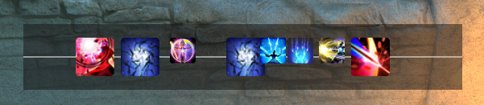

## SkillDisplay
A simple no-frills ACTWebSocket overlay for showing actions pressed in an overlay window.

## Installation
Make sure the 'Using BeforeLogLineRead' box is checked in ACTWebSocket then click the 'Add URL' button to add this URL:
`https://rawrington.github.io/SkillDisplay/`

## Troubleshooting
I have only tested and confirmed this working on the QT5.8.0 variant of OverlayProc with ACTWebSocket 1.3.3.9 so if you are having trouble please use these versions.

If you find any strange bugs, please report to me on here or find me on the ACT FFXIV discord.

## Preview

